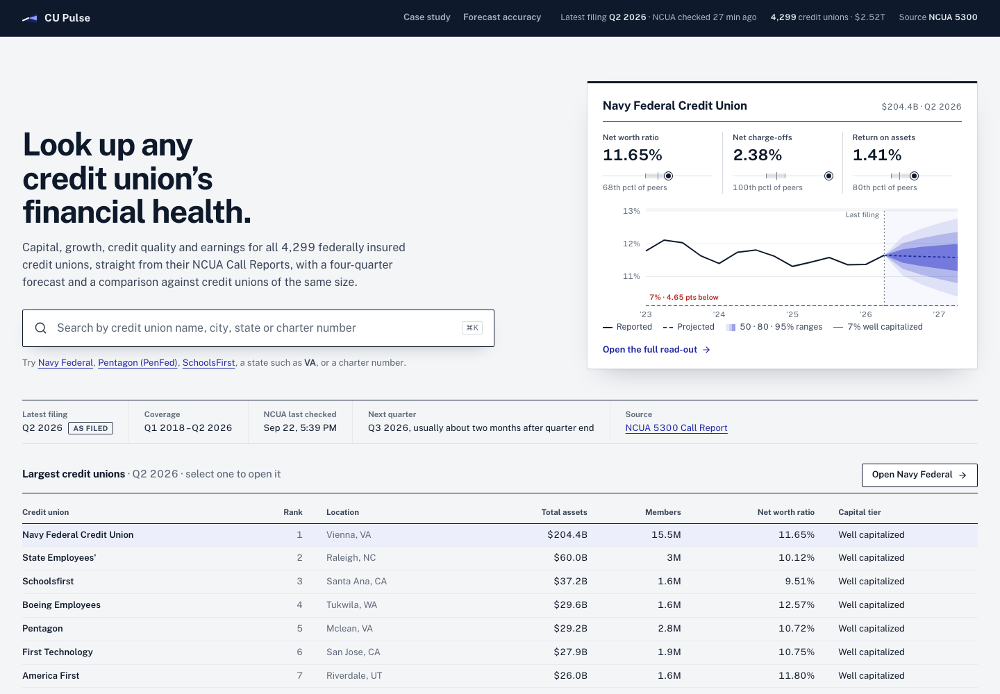
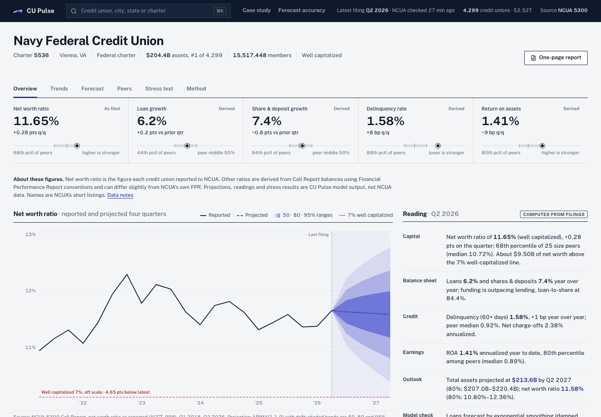
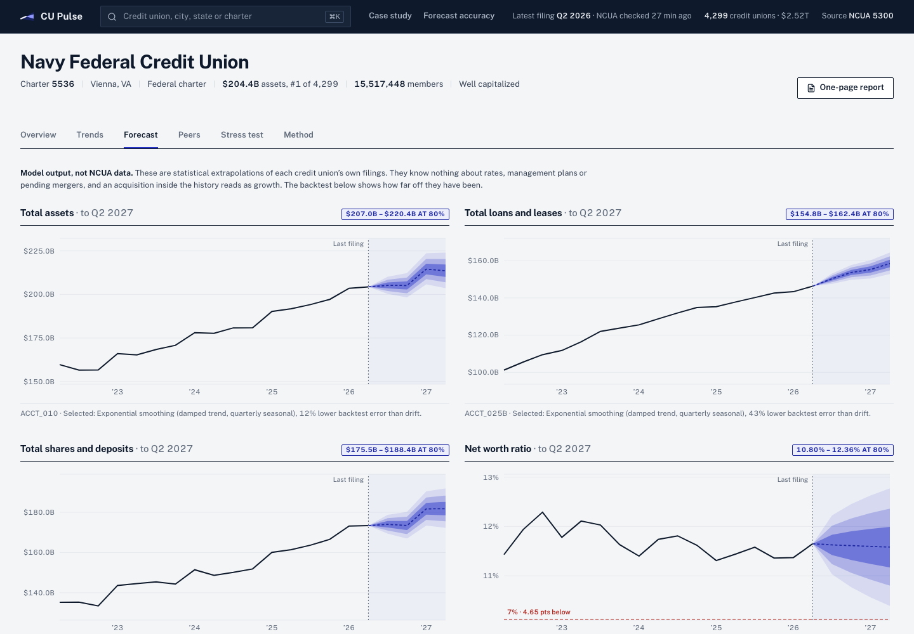
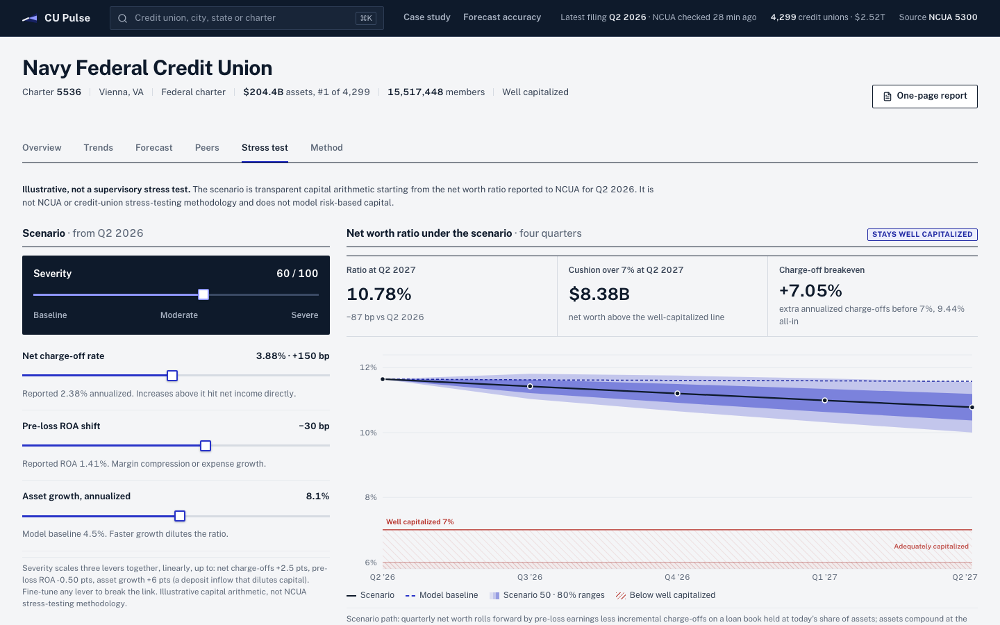
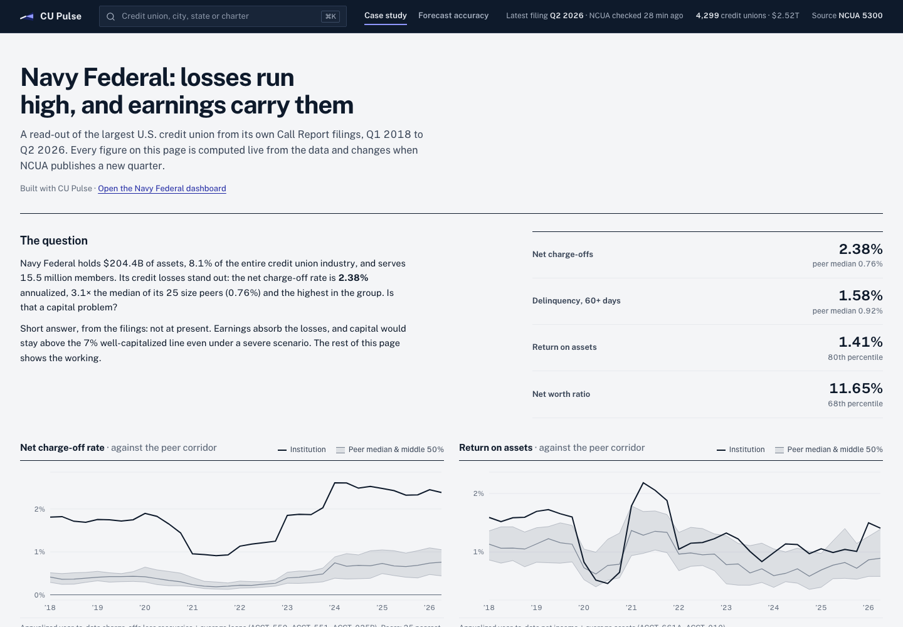
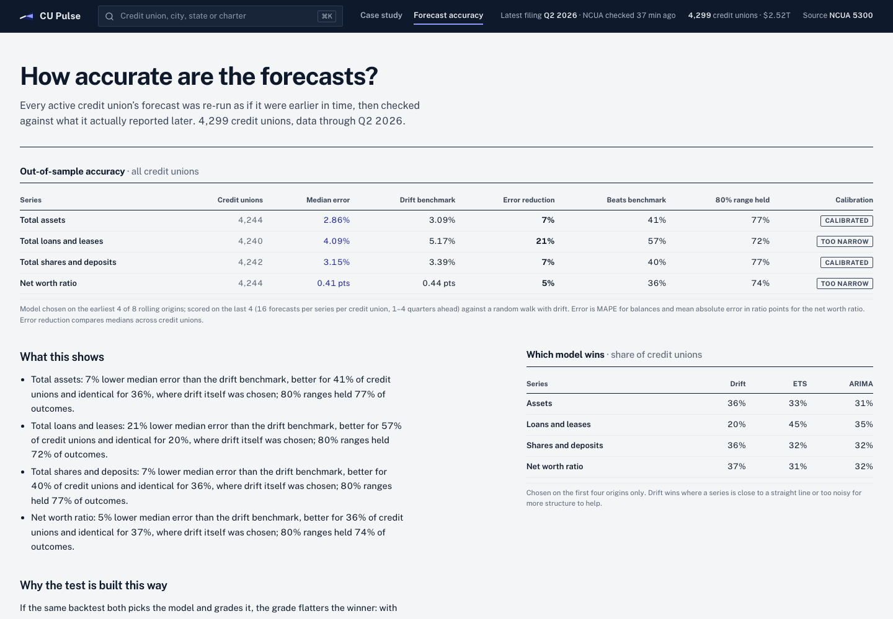
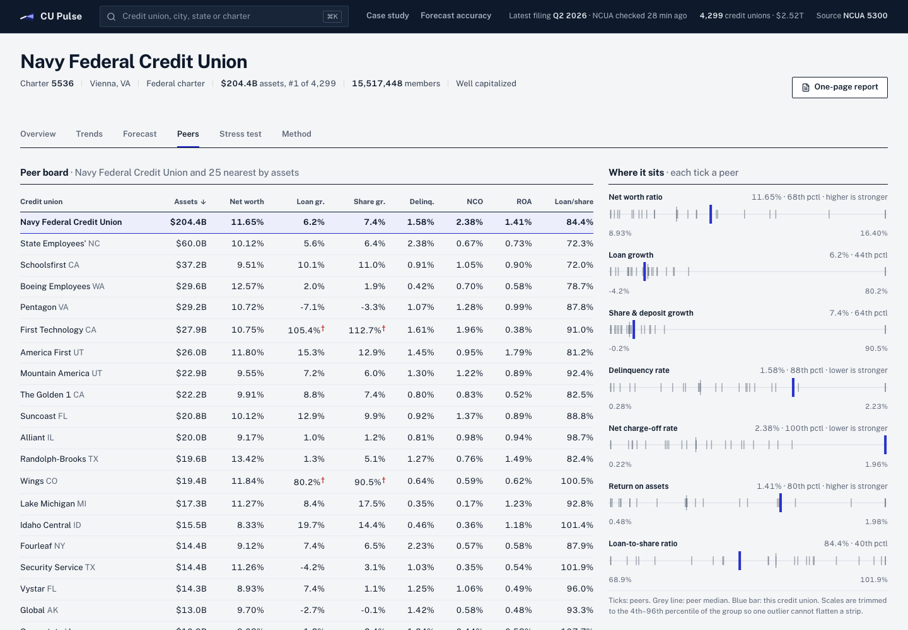

# CU Pulse

**Live app: [cu-pulse.onrender.com](https://cu-pulse.onrender.com)** (free hosting; the first visit after a quiet spell takes about 30 seconds to wake)

Financial health, four-quarter forecasts, and size-matched peer benchmarks for every U.S. federally insured credit union, built on NCUA's public 5300 Call Report data. Opens on Navy Federal Credit Union (charter 5536).

Product context lives in [PRODUCT.md](PRODUCT.md); the Navy Federal write-up is in [CASE_STUDY.md](CASE_STUDY.md).



| Dashboard | Forecast and backtest |
|---|---|
|  |  |
| **Stress test** | **Case study** |
|  |  |
| **Forecast accuracy, every credit union** | **Peers** |
|  |  |

**Headline result:** across all 4,299 active credit unions, scored on quarters the model choice never saw, the loans forecast cuts median error by 21% against a random walk with drift and beats it for 57% of credit unions. Its 80% ranges hold 72% of outcomes, so they are somewhat too narrow, and the app says so.

## What it does

- **Overview:** headline ratios with peer percentiles, the net worth ratio with a 50/80/95% forecast fan over NCUA capital tiers, a reading generated from the numbers, and as-filed balances with their account codes.
- **Trends:** seven ratios against the peer median and middle 50%, over 3 years, 5 years or all history. Hovering one chart moves the cursor on all of them.
- **Forecast:** total assets, loans, shares & deposits and the net worth ratio four quarters ahead. For each series, three models (random walk with drift, damped seasonal exponential smoothing, ARIMA) compete in an 8-origin rolling backtest. The page shows each model's error by horizon, how often its ranges contained the actual value, and a predicted-versus-reported table.
- **Peers:** the 25 credit unions nearest in total assets, in a sortable table with the subject pinned, plus per-metric distribution strips.
- **Stress test:** one severity control moves charge-offs, pre-loss ROA and asset growth together; each lever can also be set by hand. Shows the four-quarter capital path against the 7% well-capitalized line and the extra charge-off rate the institution could absorb before crossing it.
- **Method:** data lineage, formulas and account codes, peer and forecast methodology, limitations.
- **One-page report:** a printable read-out of any institution (Print or save as PDF).
- **Case study:** Navy Federal's elevated charge-offs against its earnings and capital, built entirely from live figures.
- **Forecast accuracy:** the forecast re-run for every active credit union and scored on quarters the model choice never saw.

## Run

```bash
# 1. API dependencies. A prebuilt data panel (api/data/processed/call_reports.csv.gz) is committed.
cd api
python3 -m venv .venv && .venv/bin/pip install -r requirements.txt
# Optional: refresh the panel from ncua.gov (34 quarterly zips, ~280 MB)
.venv/bin/python -m pipeline.ncua --download

# 2. API (http://127.0.0.1:8000, docs at /docs)
.venv/bin/uvicorn app.main:app --reload

# 3. Web (http://localhost:5173, proxies /api to :8000)
cd ../web
npm install
npm run dev
```

## Tests

```bash
cd api && .venv/bin/pip install -r requirements-dev.txt && .venv/bin/python -m pytest -q tests
cd web && npm test
```

The Python suite covers the ratio definitions on hand-built filings, Navy Federal's 2026Q2 figures against its filing, reported versus computed net worth ratio, peer selection, forecasting on series with known answers (drift recovery, interval nesting, coverage on a true random walk), zip parsing, the update logic (new and amended quarters, no network), and the API contract. The frontend suite covers the stress-test arithmetic (the breakeven solves to exactly 7%), fan construction, the generated reading, formatters and axis ticks. GitHub Actions runs both on every push (`.github/workflows/ci.yml`).

## Industry backtest

```bash
cd api && .venv/bin/python -m pipeline.backtest_all   # about 20 minutes on 8 cores
```

For every active credit union, the model is chosen on the earliest four of eight rolling origins and scored on the last four, so the reported accuracy is not flattered by the selection. Output: `api/data/processed/backtest_summary.json`, shown on the Forecast accuracy page.

## Deploy

The API also serves the built frontend, so the app is a single service (`Dockerfile`).

**Render (free):** push the repo to GitHub, then in Render choose New → Blueprint and pick the repo. `render.yaml` sets up one Docker web service with a health check. The committed data panel ships in the image; the daily NCUA check appends new quarters as they are published (free instances sleep when idle and check again on wake).

Any Docker host works the same way: `docker build -t cu-pulse . && docker run -p 8000:8000 cu-pulse`.

## Staying current with NCUA

While the API runs, it checks ncua.gov every 24 hours for the next quarter's Call Report file, and re-checks the two most recent quarters for amendments. When anything changed, it rebuilds the panel and swaps it in without a restart. Open pages show a banner offering to load the new quarter. NCUA usually publishes about two months after quarter end.

- Change the interval with `CUPULSE_UPDATE_HOURS` (e.g. `CUPULSE_UPDATE_HOURS=6`); `0` turns checks off.
- Run a check by hand: `.venv/bin/python -m pipeline.ncua --update`.
- Status (last check, the quarter it is waiting for, any error) is in `/api/meta` under `updates` and on the Method page.

## Accuracy

- **As filed:** balances and the net worth ratio (NCUA's reported `ACCT_998`, the figure prompt corrective action uses).
- **Derived:** growth, delinquency, ROA, net charge-offs and loan-to-share, calculated with FPR conventions; they can differ slightly from NCUA's own FPR.
- **Model output:** forecasts, the generated reading, peer percentiles and stress results.

The Method page's Data notes cover names, extreme values and mergers.

## Layout

- `api/pipeline/ncua.py`: downloads and parses the Call Report zips (`FOICU`, `FS220`, `FS220A`) into `data/processed/call_reports.csv.gz`
- `api/pipeline/metrics.py`: ratio definitions (FPR conventions), capital (PCA) tiers, peer selection and statistics
- `api/pipeline/forecast.py`: candidate models, rolling-origin backtest, interval coverage, honest out-of-sample evaluation
- `api/pipeline/backtest_all.py`: the industry-wide backtest
- `api/pipeline/case_study.py`: regenerates CASE_STUDY.md from the data
- `api/tests/`, `web/src/lib/__tests__/`: test suites
- `api/app/main.py`: FastAPI routes `/api/meta`, `/api/credit-unions?q=`, `/api/credit-unions/{charter}`, `/peers`, `/forecast`
- `web/src/`: React app (Vite, Recharts, Public Sans). `views/` has one file per section; `lib/analysis.js` holds the generated reading and the stress-test math.

Not affiliated with NCUA or any credit union.
